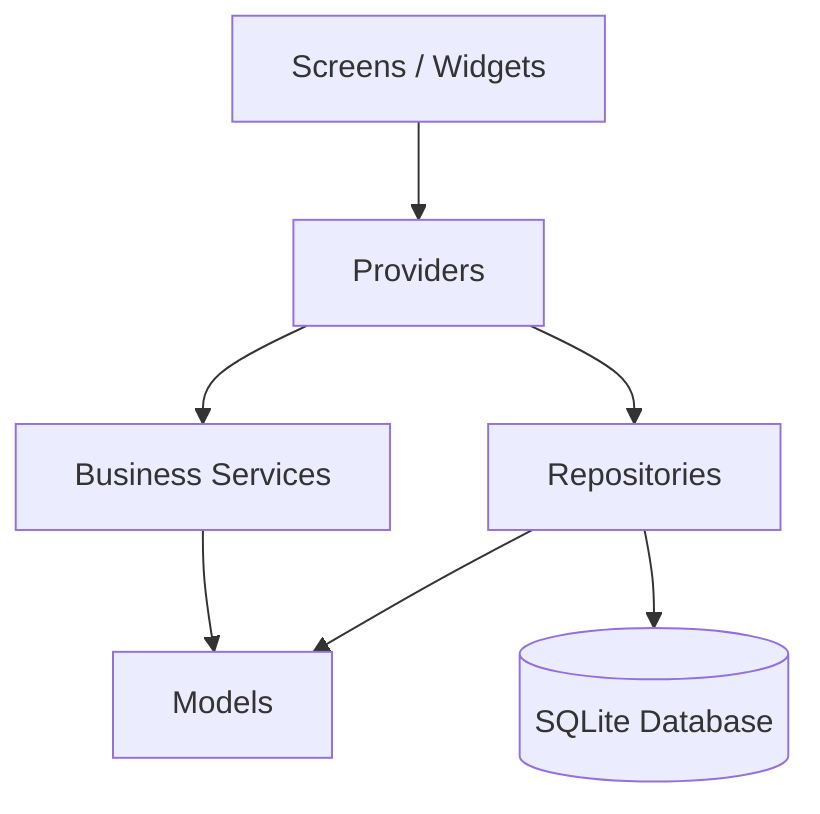

# MotoFinance

> Controle financeiro para motociclistas autônomos — quanto entrou, quanto saiu e quanto sobrou de verdade.


---

## O Problema

Muitos profissionais de entrega e mototaxi sabem quanto faturaram no dia, mas não conseguem responder com clareza: **quanto sobrou?**

Combustível, alimentação, manutenção e tempo de espera corroem a margem sem que o profissional perceba. O MotoFinance resolve isso com uma interface direta, pensada para ser usada entre uma corrida e outra.

---

## Funcionalidades

### Dashboard Diário
- Saldo líquido do dia em destaque
- Total de quilômetros rodados
- Ganho por km e ganho por hora
- Resumo de jornadas abertas e encerradas

### Gestão de Jornadas
- Abertura com quilometragem inicial
- Encerramento com cálculo automático de km rodados
- Histórico recente de jornadas

### Ganhos e Despesas
- Registro de ganho principal por jornada
- Registro de ganhos extras com descrição
- Registro de despesas por categoria
- Remoção de registros individuais

### Relatórios
- Consolidação semanal e mensal
- Totais de km, horas, ganhos e despesas
- Detalhamento diário de operação

### Controle de Dados
- Persistência local offline via SQLite
- Integridade referencial com chaves estrangeiras
- Limpeza completa dos dados com confirmação explícita

---

## Screenshots

> Em breve: dashboard, jornada, ganhos/despesas e relatórios.

---

## Stack

| Camada | Tecnologia |
|---|---|
| UI e estado | Flutter + Provider |
| Persistência | SQLite via `sqflite` |
| Desktop (dev) | `sqflite_common_ffi` |
| Internacionalização | `intl` |
| Utilitários | `path` |

---

## Arquitetura

O projeto segue uma arquitetura em camadas com responsabilidades claras:

```
lib/
  core/database/     → inicialização, esquema e migrações
  models/            → entidades da aplicação
  repositories/      → acesso e persistência de dados
  services/          → regras de negócio e cálculos financeiros
  providers/         → estado observável e coordenação da UI
  screens/           → exibição e interação com o usuário
  themes/            → configuração visual
  main.dart
test/
  core/database/
  provider/
  services/
  widget_test.dart
```



---

## Decisões Técnicas

### Offline-first
SQLite garante funcionamento sem internet, sem latência de rede e sem dependência de backend — essencial para um profissional em campo.

### Regras de negócio fora da UI
Os cálculos de dashboard e relatórios vivem na camada de `services`, não nos widgets. Isso reduz acoplamento, facilita testes e permite reutilização.

### Acesso a dados via repositórios
A camada de repositórios centraliza leitura e escrita no banco, mantendo uma fronteira clara entre estado e persistência.

### Singleton seguro contra concorrência
O `DatabaseHelper` usa um `Completer<Database>` para evitar dupla inicialização em acessos simultâneos — detalhe que costuma ser ignorado em projetos de estudo.

---

## Testes

```bash
flutter analyze
flutter test
```

Cobertura atual:

- Criação e integridade do esquema SQLite
- Persistência entre fechamento e reabertura do banco
- Operações de repositório (CRUD)
- Cálculos de dashboard e relatórios
- Smoke test da tela principal

---

## Como Rodar

### Pré-requisitos

- Flutter SDK instalado
- Emulador Android ou dispositivo físico

### Instalação

```bash
git clone https://github.com/seu-usuario/motofinance.git
cd motofinance
flutter pub get
flutter run
```

---

## Roadmap

- [ ] Exportação de relatórios em PDF
- [ ] Filtros por período nos relatórios
- [ ] Métricas comparativas (dia vs semana vs mês)
- [ ] Onboarding e preferências do usuário
- [ ] Sincronização opcional em nuvem

---

## Autor

**Juliano**
[GitHub](https://github.com/Destroier1945) · [LinkedIn](https://www.linkedin.com/in/juliano-kluge/)
