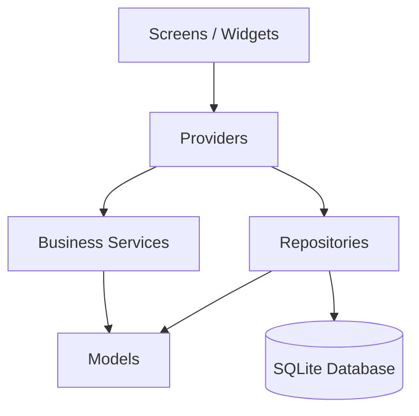

# MotoFinance

Aplicativo mobile em Flutter para gestão financeira de motociclistas que trabalham com entregas, corridas ou jornadas autônomas. O foco do produto é transformar a rotina operacional em números claros: quanto entrou, quanto saiu e quanto realmente sobrou no dia.

## Overview

MotoFinance is a Flutter mobile app designed for delivery riders and independent motorcycle workers who need a simple way to track daily operations and understand real net income. The application is built with a local-first approach, using SQLite for persistence and a layered architecture that keeps business rules out of the UI.

## Portfolio Highlights

- real-world product focused on daily financial control for riders
- Flutter app with dark, mobile-oriented UI
- local persistence with SQLite for offline usage
- layered architecture with clear separation between UI, state, data access and business logic
- extracted business rules for dashboard and reporting calculations
- automated tests covering database, repositories, metrics and widget rendering

## Demo Showcase

### App Preview

Use this section to display screenshots from the main flow:

- dashboard overview
- journey lifecycle
- extra income and expense registration
- weekly/monthly reports

Suggested asset paths:

- `docs/readme/dashboard.png`
- `docs/readme/jornada.png`
- `docs/readme/ganhos-despesas.png`
- `docs/readme/relatorios.png`

### Navigation GIF

Suggested asset path:

- `docs/readme/motofinance-flow.gif`

Markdown ready to use after exporting the assets:

```md


```

## Product Vision

O MotoFinance foi pensado para resolver um problema operacional recorrente: muitos profissionais sabem quanto faturaram, mas não conseguem medir com clareza o lucro real após combustível, alimentação, manutenção e demais custos do dia.

Com o app, o usuário pode:

- iniciar e finalizar jornadas
- registrar ganhos principais e extras
- registrar despesas por jornada
- acompanhar saldo líquido, ganho por km e ganho por hora
- visualizar relatórios por semana e por mês
- zerar o banco local com confirmação explícita

## Core Features

### Daily Dashboard

- resumo do dia com jornadas abertas ou encerradas
- total de quilômetros rodados
- ganho líquido consolidado
- ganho por km
- ganho por hora

### Journey Management

- abertura de jornada com quilometragem inicial
- encerramento com cálculo de km rodados
- histórico recente de jornadas

### Income and Expenses

- cadastro de ganhos extras
- persistência de ganho principal por jornada
- cadastro de despesas por categoria
- listagem e remoção de registros

### Reports

- consolidação semanal e mensal
- totais de km, horas, ganhos e despesas
- detalhamento diário de operação

### Local Data Control

- persistência em banco local SQLite
- integridade referencial com `foreign keys`
- validações de valores e quilometragem
- opção de limpar todos os dados locais

## Tech Stack

- Flutter
- Dart
- Provider
- SQLite with `sqflite`
- `intl`
- `path`
- `sqflite_common_ffi`

## Architecture

O projeto está organizado para manter responsabilidades claras e facilitar evolução:

- `screens/`: exibição e interação com o usuário
- `providers/`: estado observável e coordenação da UI
- `repositories/`: acesso e persistência de dados
- `services/`: regras de negócio e cálculos financeiros
- `models/`: entidades da aplicação
- `core/database/`: inicialização, esquema e migrações

### Layer Diagram



### Project Structure

```text
lib/
  core/database/
  models/
  providers/
  repositories/
  screens/
  services/
  themes/
  main.dart
test/
  core/database/
  provider/
  services/
  widget_test.dart
```

## Engineering Decisions

### 1. Offline-first persistence

SQLite foi escolhido para garantir funcionamento local e rápido, sem dependência de backend para o fluxo principal do produto.

### 2. Business rules outside the UI

Os cálculos de dashboard e relatórios foram extraídos para a camada de `services`, reduzindo acoplamento e melhorando testabilidade.

### 3. Repository-based data access

A camada de repositórios centraliza escrita e leitura do banco, preservando uma fronteira clara entre estado e persistência.

### 4. Test-oriented reliability

O projeto inclui validações automatizadas para banco, persistência, cálculos e renderização básica da interface.

## Quality and Validation

Cobertura atual de qualidade:

- criação e integridade do banco SQLite
- persistência entre fechamento e reabertura do banco
- operações dos repositórios
- cálculos de dashboard e relatórios
- smoke test da home

Comandos utilizados:

```bash
flutter analyze
flutter test
```

## Running the Project

### Requirements

- Flutter SDK instalado
- Dart SDK compatível
- Android Studio ou VS Code com suporte Flutter
- emulador ou dispositivo físico

### Local Setup

```bash
flutter pub get
flutter run
```

## Why This Project Works Well as a Portfolio Piece

- aborda um problema real de rotina e monetização
- demonstra domínio de Flutter além do layout básico
- mostra persistência local funcional e arquitetura organizada
- evidencia preocupação com manutenção, separação de camadas e testes
- possui uma proposta de produto clara, não apenas uma UI de demonstração

## Roadmap

- autenticação e sincronização em nuvem
- exportação de relatórios
- filtros avançados por período
- métricas comparativas por dia e semana
- onboarding e preferências do usuário

## Author

Juliano

---

Para apresentação de portfólio, a recomendação é adicionar 4 screenshots e 1 GIF curto em `docs/readme/` para transformar este README em uma vitrine completa do produto.
