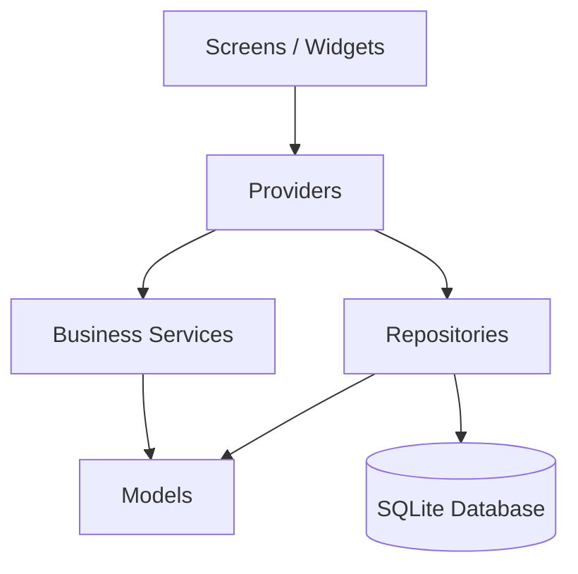

# MotoFinance

> Financial control for independent motorcycle workers — what came in, what went out, and what actually remained.


---

## The Problem

Many delivery riders and independent motorcycle workers know how much they earned in a day, but can't clearly answer: **how much did I actually keep?**

Fuel, food, maintenance, and idle time silently eat into margins. MotoFinance solves this with a direct, no-friction interface designed to be used between rides.

---

## Features

### Daily Dashboard
- Net balance of the day in focus
- Total kilometers ridden
- Earnings per km and per hour
- Summary of open and closed journeys

### Journey Management
- Open a journey with initial odometer reading
- Close with automatic km calculation
- Recent journey history

### Income and Expenses
- Log main income per journey
- Log extra income with description
- Log expenses by category
- Remove individual records

### Reports
- Weekly and monthly consolidation
- Totals for km, hours, income and expenses
- Daily operation breakdown

### Data Control
- Offline-first local persistence via SQLite
- Referential integrity with foreign keys
- Full data wipe with explicit confirmation

---

## Screenshots

> Coming soon: dashboard, journey, income/expenses and reports.

---

## Tech Stack

| Layer | Technology |
|---|---|
| UI and state | Flutter + Provider |
| Persistence | SQLite via `sqflite` |
| Desktop (dev) | `sqflite_common_ffi` |
| Internationalization | `intl` |
| Utilities | `path` |

---

## Architecture

The project follows a layered architecture with clear responsibilities:

```
lib/
  core/database/     → initialization, schema and migrations
  models/            → application entities
  repositories/      → data access and persistence
  services/          → business rules and financial calculations
  providers/         → observable state and UI coordination
  screens/           → display and user interaction
  themes/            → visual configuration
  main.dart
test/
  core/database/
  provider/
  services/
  widget_test.dart
```



---

## Engineering Decisions

### Offline-first
SQLite ensures the app works without internet, without network latency, and without backend dependency — essential for a professional working in the field.

### Business rules outside the UI
Dashboard and report calculations live in the `services` layer, not in widgets. This reduces coupling, improves testability, and enables reuse.

### Repository-based data access
The repository layer centralizes database reads and writes, maintaining a clear boundary between state and persistence.

### Concurrency-safe singleton
`DatabaseHelper` uses a `Completer<Database>` to prevent double initialization on simultaneous access — a detail often overlooked in study projects.

---

## Tests

```bash
flutter analyze
flutter test
```

Current coverage:

- SQLite schema creation and integrity
- Persistence across database close and reopen
- Repository operations (CRUD)
- Dashboard and report calculations
- Home screen smoke test

---

## Getting Started

### Requirements

- Flutter SDK installed
- Android emulator or physical device

### Setup

```bash
git clone https://github.com/your-username/motofinance.git
cd motofinance
flutter pub get
flutter run
```

---

## Roadmap

- [ ] PDF report export
- [ ] Date range filters on reports
- [ ] Comparative metrics (day vs week vs month)
- [ ] Onboarding and user preferences
- [ ] Optional cloud sync

---

## Author

**Juliano**
[GitHub](https://github.com/Destroier1945) · [LinkedIn](https://www.linkedin.com/in/juliano-kluge/)
